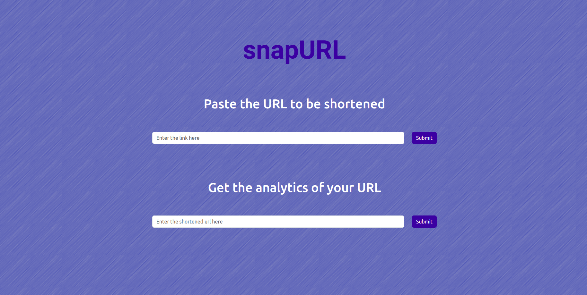
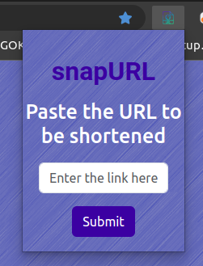

# SnapUrl

A URL shortener browser extension and website for convenient link sharing and get analytics of your URL as well.

[](https://kanhaiya04.github.io/snapURL/)

# Installation

Clone the repo

```bash
git clone https://github.com/kanhaiya04/snapURL.git
cd snapURL/
```

Use the package manager to install dependencies.

```bash
npm install
```

## Run on local server

To start the server

```bash
node index
```

### Website



```bash
cd client/index.html
```

### browser extension



Load the extension in browser from specified path

```bash
cd extension/manifest.json
```
